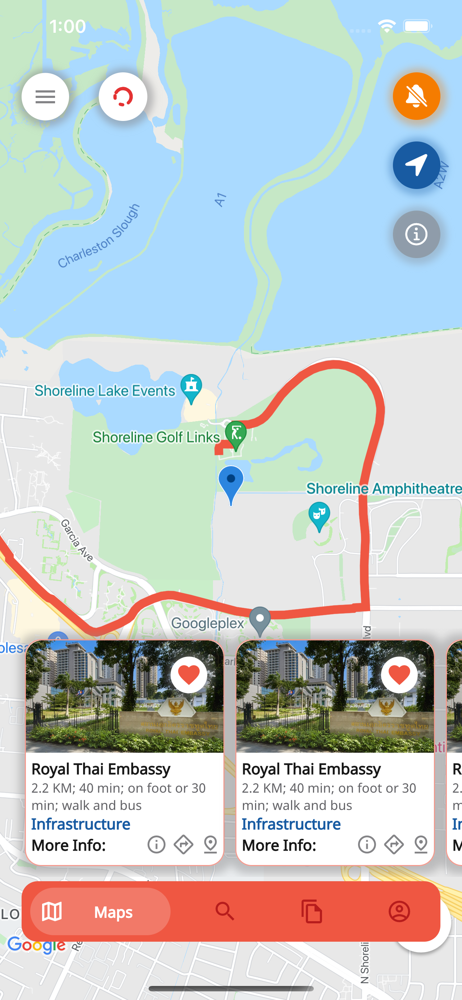
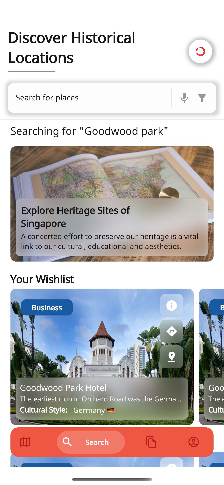
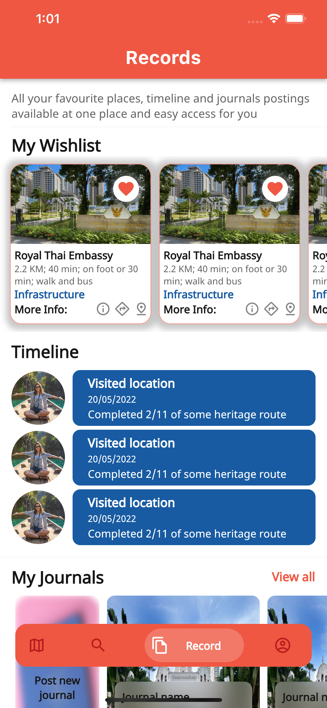
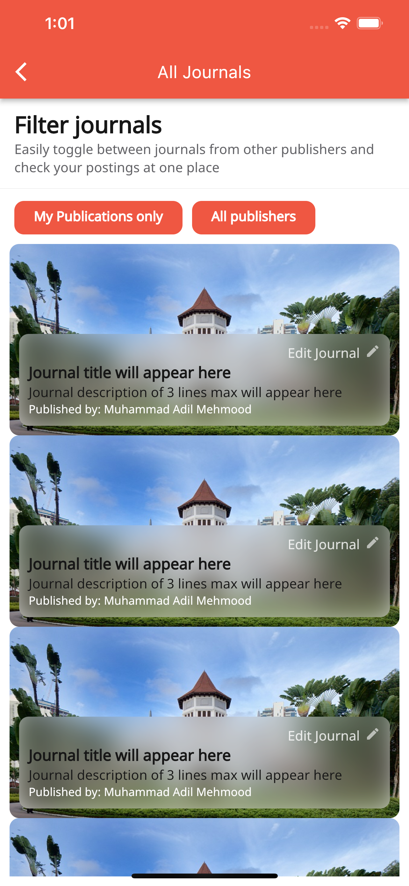
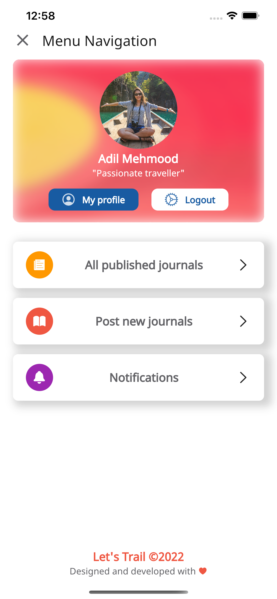

# letstrail

LetsTrail Mobile application built on Flutter with backend services on Firebase Firestore and Firestore Storage along with usage of Cloud Functions and messaging for notifications and firebase authentication for logins.

“Let’s Trail” is the mobile app which assist the users to schedule, track and explore the heritage trail places nearby their location. Historical information and activities are provided for a better planning decision. Mobile users can select the favourite suggested trail places. They can select their favourite places and make it into a scheduled plan. Users will tracked the selected plan based on the guide of the map in the app. After trailing, user can also write down the thoughts into the app.
The software to be used are developed by Google, which are Flutter ,Dart and Firebase. Microsoft Visual Studio is selected for having an Integrated development environment.

     
     
     
     
     
     

Commands to run on M1 Mac:

sudo arch -x86_64 gem install ffi (In root directory)
arch -x86_64 pod install (In iOS directory)